###  Lab 1 Shell script
```sh
cd lab-1-shellscript/
bash ken.sh 
```
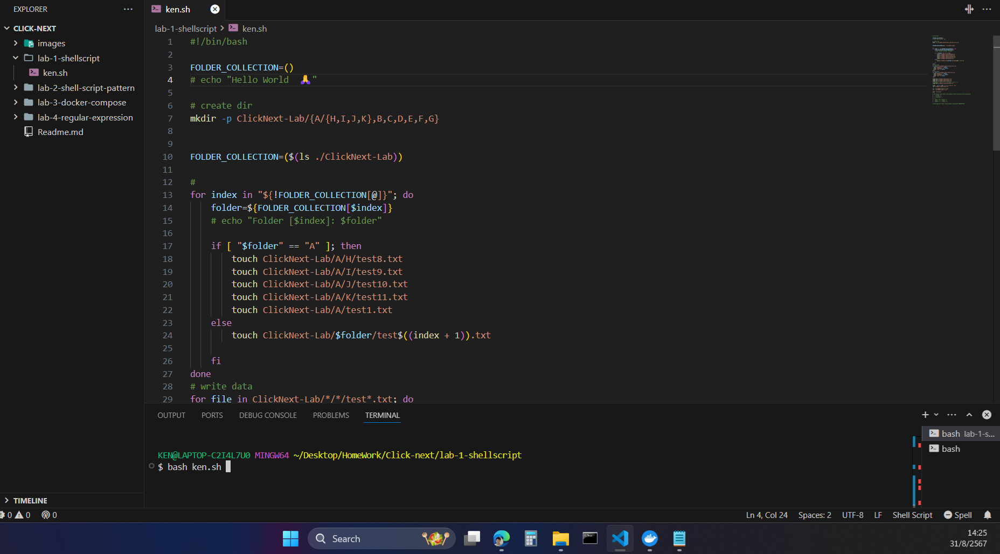
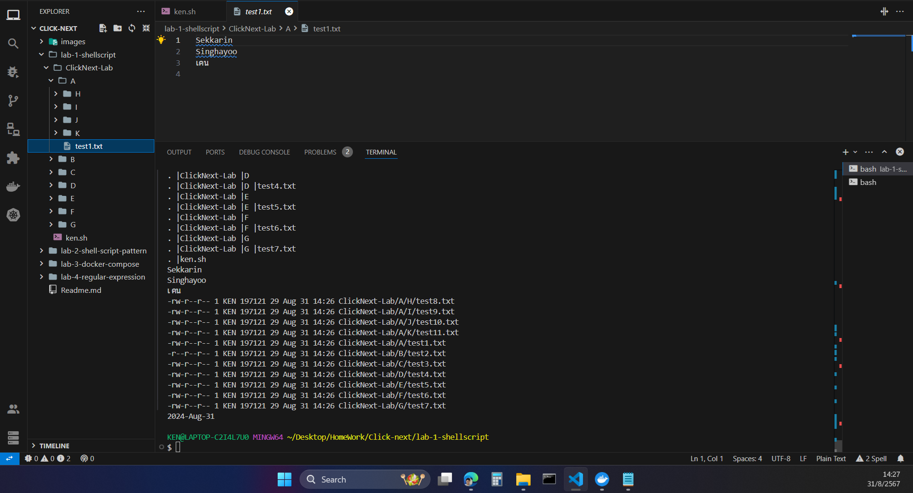
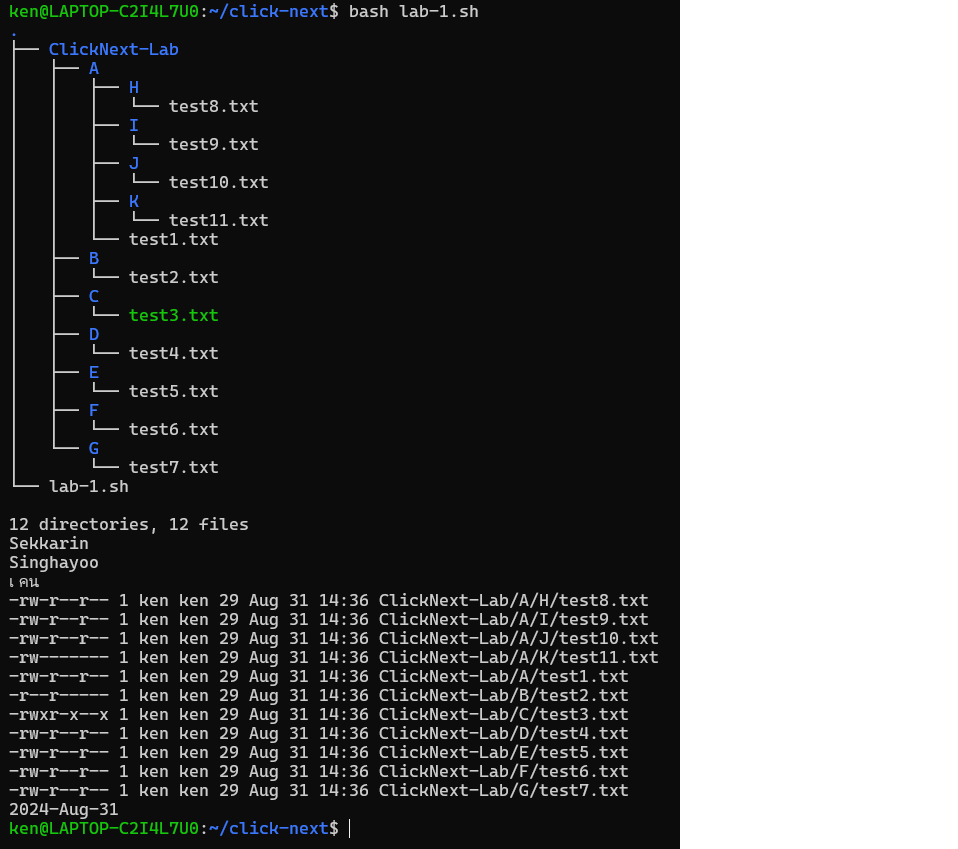

###  Lab 2 Shell script pattern
```sh
cd lab-2-shell-script-pattern/
bash finish_loop.sh
```
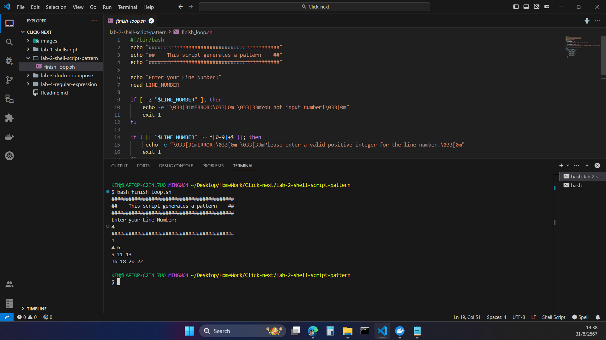
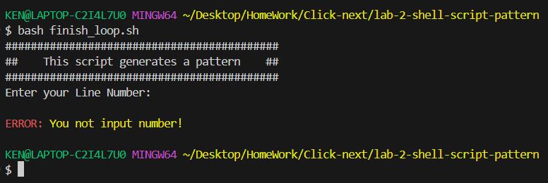
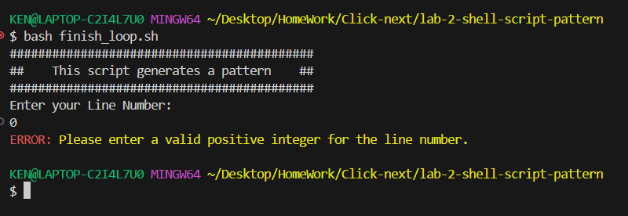
###  Lab 3 docker compose Reverse Proxy
```sh
cd cd lab-3-docker-compose/
docker compose up -d
```
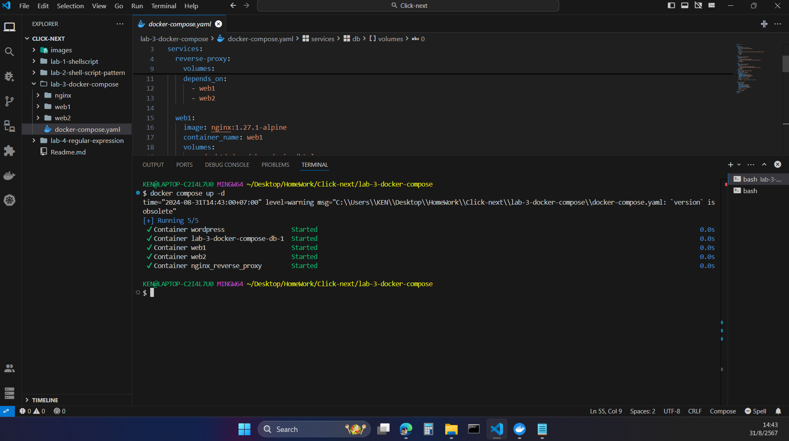
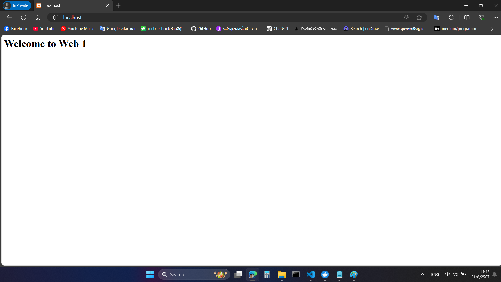
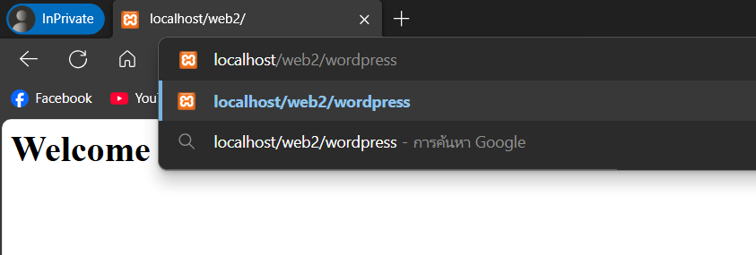
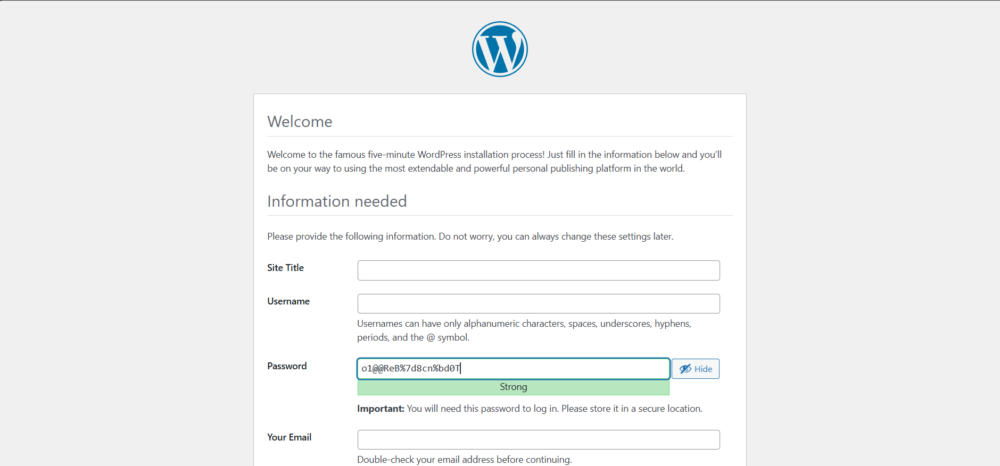
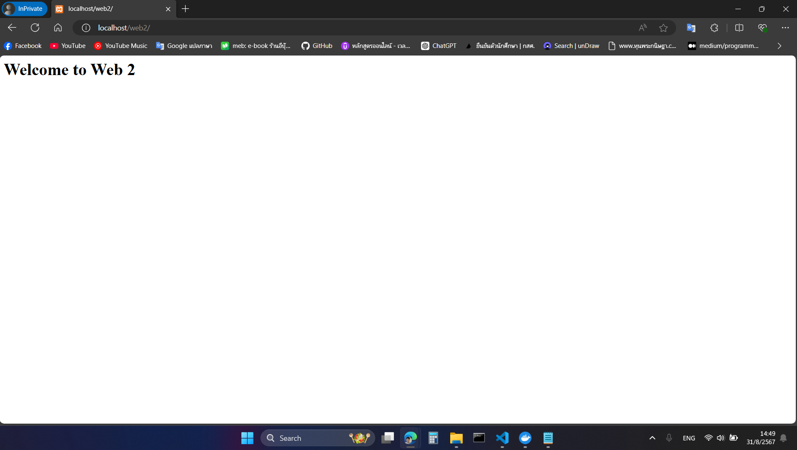


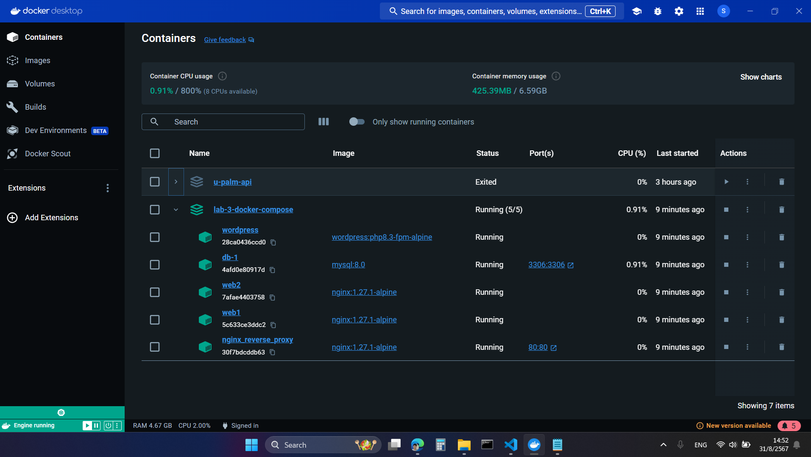

###  Lab 4 Regular expression
```sh
cd lab-4-regular-expression/
npx ts-node reg-exrpession.ts
```
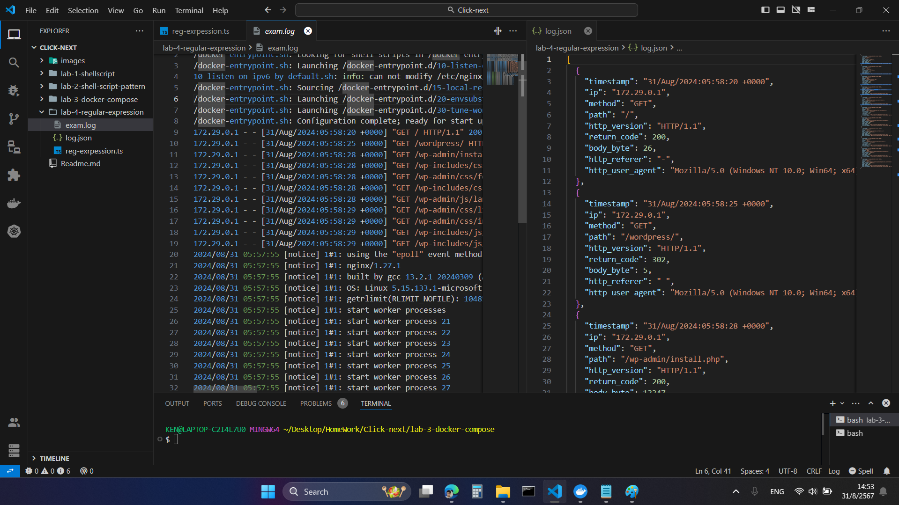


